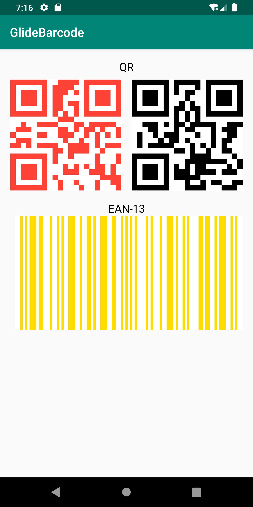

# Glide-Barcode
[](https://jitpack.io/#illiashenkoo/glide-barcode)
[]( https://android-arsenal.com/details/1/7661 )

GlideBarcode is an open-source barcode loading extension for Android Glide that wraps barcode generating and displaying.

## Example


## Integration 
Step 1. Add the JitPack repository to your root build.gradle at the end of repositories.
```groovy
allprojects {
    repositories {
        //...
        maven { url 'https://jitpack.io' }
    }
}
```

Step 2. Add the dependency
```groovy
dependencies {

    /* Zxing */
    implementation 'com.google.zxing:core:X.X.X'

    /* Glide */
    implementation 'com.github.bumptech.glide:glide:X.X.X'
    kapt 'com.github.bumptech.glide:compiler:X.X.X'
    
    implementation 'com.github.illiashenkoo.glide-barcode:glide-barcode:X.X.X'
}
```
## Example of use
Step 1. Include a [AppGlideModule](https://bumptech.github.io/glide/doc/generatedapi.html) implementation in your application:
``` kotlin
@GlideModule
class MyAppGlideModule : AppGlideModule() {
    override fun registerComponents(context: Context, glide: Glide, registry: Registry) {
        super.registerComponents(context, glide, registry)
    }
}
```

Step 2. Initialize  GlideBarcode => GlideBarcode.registerFactory(registry)
``` kotlin
@GlideModule
class MyAppGlideModule : AppGlideModule() {
    override fun registerComponents(context: Context, glide: Glide, registry: Registry) {
        super.registerComponents(context, glide, registry)
        GlideBarcode.registerFactory(registry)
    }
}
```

Step 3. Create barcode object
``` kotlin
val barcode = Barcode("QrCode", BarcodeFormat.QR_CODE)
```

Step 4. Show barcode
``` kotlin
Glide.with(this)
    .load(barcode)
    .into(imageView)
```

## Links

* [Glide image loader](https://github.com/bumptech/glide)
* [Zxing barcode generator](https://github.com/zxing/zxing)

## Contacts

[Oleg Illiashenko](mailto:illiashenkoo.dev@gmail.com)